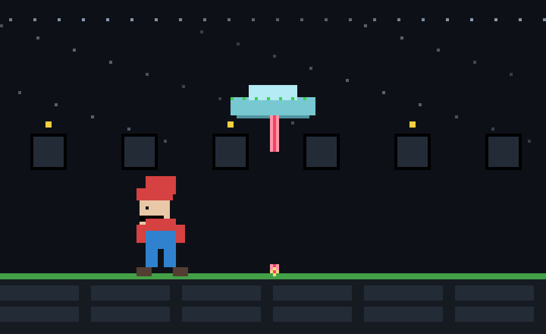

# Salut 👋

**Construire des projets. Apprendre. Se surpasser.**  
Projets 42 du tronc-commun & projets personnels.

  
  
  

---

  

---

### Projets phares 42
- **ft_transcendence** — site web full-stack, microservices, mode en ligne, collaboration.  
- **miniRt** — Algorithmes, maths appliquées, C, Rendu 3D (ray-tracing), collaboration.  
- **minishell** — recréation d'un shell type Bash en C, collaboration.  

---

### Compétences & outils
`TypeScript` · `JavaScript` · `C` · `C++` · `HTML` · `Node.js` · `Fastify` · `WebSocket`  
`Docker` · `SQLite` · `Nginx` · `n8n` · `ImageKit` · `Cloudinary` · `Firebase`

---

### Ce qui compte pour moi
- **Travail d'équipe** → organisation, peer learning.  
- **Clarté d’abord** → interfaces épurées, code lisible, erreurs explicites.  
- **Apprendre** → Toujours relever de nouveaux défis, apprendre de nouveaux langages.

---

### Contact
[LinkedIn](https://www.linkedin.com/in/simon-barbé-b77792364) — je lis tout.

