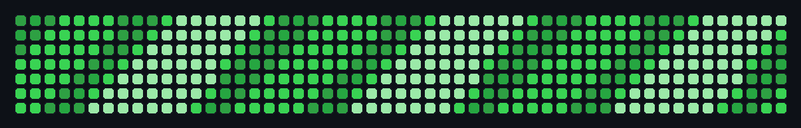

# Hi there 👋

**Building cool stuff. Learning fast. Shipping often.**  
Crafting apps, automations & playful UIs.

<!-- Badges -->

---

### 🎞️ Contributions (loop animée)
> Pixel-art runner + OVNI (loop parfaite)

  

<!-- Tu peux réactiver ta vague si tu veux alterner : -->
<!-- 

 -->

---

### 🚀 Projects (sélection)
- **Pong Online** — moteur 100% backend (WebSocket), rendu frontend léger, matchmaking 1v1.  
- **WP/N8N Automations** — génération d’articles, traduction NL-BE, publication auto, maillage interne.  
- **Data Scrapers BE** — BCE / BNB / Moniteur : extraction fiable + Excel/CSV, logs & reprise.  

> 👉 Envies du moment: microservices (Fastify), jobs CRON propres, front minimal & rapide.

---

### 🧰 Tech & Tools
`TypeScript` · `Node.js` · `Fastify` · `WebSocket` · `Python` · `Pandas` · `Selenium`  
`Docker` · `SQLite` · `WordPress API` · `Polylang` · `n8n` · `ImageKit` · `Cloudinary`

---

### 📌 What I value
- **Clarity first** → UI clean, code lisible, erreurs explicites.  
- **Speed to ship** → prototypes utiles > promesses.  
- **DX matters** → scripts, README & exemples prêts à l’emploi.

---

### 📫 Contact
DM on GitHub or open an issue on a repo — I read everything.

